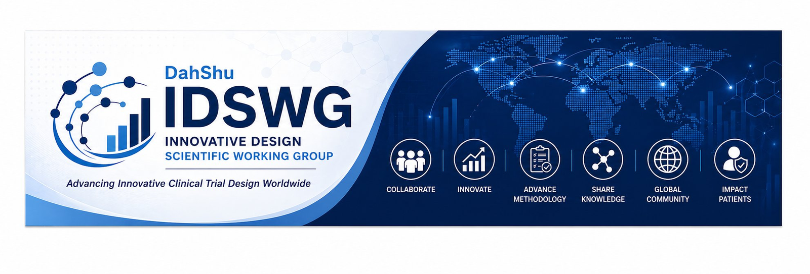

```{=html}
<div class="hero-banner">
  
</div>

<div class="hero-section" id="main-content">
  <h1>DahShu Innovative Design Scientific Working Group</h1>
  <p class="lead">A cross-industry scientific community advancing innovative clinical trial design for the benefit of patients worldwide.</p>
  <p class="hero-tagline">Advancing Innovative Clinical Trial Design Worldwide</p>
  <div style="margin-top:1.4rem;display:flex;gap:0.75rem;justify-content:center;flex-wrap:wrap;">
    <a href="join.qmd" style="display:inline-block;background:white;color:#0D2B6B;font-weight:700;font-size:0.88rem;padding:0.6rem 1.6rem;border-radius:3px;text-decoration:none;font-family:'Source Sans 3',Arial,sans-serif;text-transform:uppercase;letter-spacing:0.04em;">Join the IDSWG</a>
    <a href="https://www.linkedin.com/groups/18890018/" target="_blank" rel="noopener"
       style="display:inline-flex;align-items:center;gap:6px;background:transparent;border:1.5px solid rgba(255,255,255,0.6);color:white;font-weight:600;font-size:0.88rem;padding:0.6rem 1.4rem;border-radius:3px;text-decoration:none;font-family:'Source Sans 3',Arial,sans-serif;">
      <i class="bi bi-linkedin"></i> Join our LinkedIn Community
    </a>
  </div>
</div>

<div class="stats-bar">
  <div class="stat-item"><span class="stat-number">~200</span><span class="stat-label">Members</span></div>
  <div class="stat-item"><span class="stat-number">9+</span><span class="stat-label">Active Sub-teams</span></div>
  <div class="stat-item"><span class="stat-number">100+</span><span class="stat-label">KOL Speakers Since 2015</span></div>
  <div class="stat-item"><span class="stat-number">40+</span><span class="stat-label">Publications</span></div>
  <div class="stat-item"><span class="stat-number">10+</span><span class="stat-label">Years Active</span></div>
</div>

<div class="announcement-banner">
  <div class="announcement-inner">
    <div class="announcement-badge"><i class="bi bi-calendar-event"></i> Save the Date</div>
    <div class="announcement-content">
      <h3>2026 DahShu-IDSWG Annual Meeting</h3>
      <p class="announcement-detail"><strong>Wednesday, September 16, 2026</strong> &nbsp;·&nbsp; 5:30–7:15 p.m. &nbsp;·&nbsp; Bethesda North Marriott, Bethesda, MD</p>
      <p class="announcement-sub">Featuring invited speaker James Travis, Ph.D. (U.S. FDA). Held in conjunction with the ASA BioPharma RISW.</p>
      <a href="events.qmd#upcoming" class="announcement-link">Meeting details →</a>
    </div>
  </div>
</div>
```

::: {.content-section}
## Who We Are

The **DahShu Innovative Design Scientific Working Group (IDSWG)** is a cross-industry scientific community with approximately 200 members drawn from pharmaceutical companies, biotechnology firms, academic medical centers, contract research organizations, health authorities, and patient advocacy organizations across the United States, Europe, and Japan.

Members share a common premise: well-designed clinical trials are among the most powerful tools available for bringing safe and effective treatments to patients. Statisticians, clinicians, pharmacometricians, regulators, patient advocates, and operations professionals work across sub-teams to advance that premise through published methodology, regulatory engagement, and practical guidance.

```{=html}
<!-- Spotlight, randomly selected each page load -->
<div class="spotlight-box" aria-label="Member spotlight">
  <div class="spotlight-avatar" id="spotlight-avatar"></div>
  <div>
    <div class="spotlight-label">Member Spotlight</div>
    <div class="spotlight-name" id="spotlight-name"></div>
    <div class="spotlight-role" id="spotlight-role"></div>
    <p class="spotlight-bio" id="spotlight-bio"></p>
  </div>
</div>
<script>
const SPOTLIGHT = [
  { initials:"RAB", color:"linear-gradient(135deg,#0D2B6B,#1A5CB8)", name:"Robert A. Beckman, M.D.", role:"Chair, IDSWG · Georgetown University Medical Center", bio:"Pediatric oncologist and mathematical biologist. ~130 publications, 4 patents. Co-editor of Platform Trials in Drug Development. Elected Fellow, ASA." },
  { initials:"MG",  color:"linear-gradient(135deg,#164e63,#0e7490)", name:"Mercedeh Ghadessi, M.Sc.",       role:"Vice Chair & Leader of Community · Bayer", bio:"Biostatistician with over 22 years of experience in oncology and cardiovascular research. Co-leads the NEED Sub-team on rare diseases." },
  { initials:"AS",  color:"linear-gradient(135deg,#1e3a5f,#2563eb)", name:"Alex Sverdlov, Ph.D.",    role:"Vice Chair & Leader of External Collaborations · Novartis", bio:"Over 18 years in pharmaceutical biostatistics. Co-authored 50+ peer-reviewed publications and four books. Co-leads the Randomization Working Group." },
  { initials:"BM",  color:"linear-gradient(135deg,#7c2d12,#c2410c)", name:"Bryan McComb, Ph.D.",     role:"Co-Leader of External Collaborations · Pfizer", bio:"Associate Director of Biostatistics. Co-leads the Master Protocol Methodology Sub-team and the StatBridge Future Leaders Program." },
  { initials:"CH",  color:"linear-gradient(135deg,#166534,#15803d)", name:"Courtney Henry, Ph.D.",   role:"Co-Leader of Community · GSK", bio:"Co-leads the Master Protocol Methodology Sub-team and the StatBridge Future Leaders Program." },
  { initials:"JK",  color:"linear-gradient(135deg,#4a1d96,#7c3aed)", name:"Johannes Krisam, Ph.D.",  role:"Co-Leader of External Collaborations (EU) · Boehringer Ingelheim", bio:"Co-chairs the Randomization Working Group, named PSI SIG of the Year 2025." },
  { initials:"CL",  color:"linear-gradient(135deg,#0D2B6B,#0e7490)", name:"Cindy Lu",                role:"Co-Chair, Master Protocol Working Group · AstraZeneca", bio:"Co-chairs the ASA-DahShu MPWG alongside Robert Beckman. Leads the multi-disciplinary collaboration spanning platform, basket, and umbrella trial methodology." },
  { initials:"ST",  color:"linear-gradient(135deg,#065f46,#059669)", name:"Sammi Tang",               role:"Co-Lead, NEED Sub-team · Astellas", bio:"Co-leads the NEED Sub-team for Rare Diseases, with three peer-reviewed publications since 2020 on historical controls, decentralized trials, and cell and gene therapy." },
  { initials:"KW",  color:"linear-gradient(135deg,#1e3a5f,#0369a1)", name:"Kyle Wathen",              role:"Master Protocol Working Group · Cytel", bio:"Statistical leader in platform and adaptive trial design and a contributor to the ASA-DahShu MPWG. Active presenter at JSM and ICSA on master protocol methodology." },
  { initials:"PH",  color:"linear-gradient(135deg,#7c2d12,#b45309)", name:"Philip He",                role:"Chair, Oncology Sub-team · Daiichi Sankyo", bio:"Leads the IDSWG Oncology Sub-team and co-chairs the oncologytrialdesign.org initiative for innovative oncology trial design." },
  { initials:"JC",  color:"linear-gradient(135deg,#164e63,#0891b2)", name:"James Chuo",               role:"Chair, Real-World Evidence Sub-team · Gilead", bio:"Leads the RWE Sub-team with a focus on aligning real-world data types with research needs across pharmaceutical development contexts." },
  { initials:"PM",  color:"linear-gradient(135deg,#0D2B6B,#2563eb)", name:"Peter Mesenbrink",         role:"Lead, MPWG Regulatory Sub-stream · Novartis", bio:"Leads the regulatory stream of the Master Protocol Working Group, focused on FDA and EMA guidance, regulatory interaction strategies, and the ongoing systematic literature review." }
];
const s = SPOTLIGHT[Math.floor(Math.random() * SPOTLIGHT.length)];
document.getElementById('spotlight-avatar').style.background = s.color;
document.getElementById('spotlight-avatar').textContent = s.initials;
document.getElementById('spotlight-name').textContent = s.name;
document.getElementById('spotlight-role').textContent = s.role;
document.getElementById('spotlight-bio').textContent = s.bio;
</script>
```
:::

```{=html}
<div class="content-section-alt">
<div class="inner">
<h2 class="section-title">What We Work On</h2>
<p>Innovative trial design encompasses methodologies that move beyond the traditional fixed-design randomized trial to make drug development more efficient, flexible, and informative. The IDSWG focuses on six core areas:</p>
<div class="pillar-grid">
  <div class="pillar-card"><span class="pillar-icon"><i class="bi bi-diagram-3-fill"></i></span><h4>Master Protocols</h4><p>Platform, basket, and umbrella trials that evaluate multiple treatments or patient populations within a single framework.</p></div>
  <div class="pillar-card"><span class="pillar-icon"><i class="bi bi-sliders"></i></span><h4>Adaptive Designs</h4><p>Trials with pre-specified modifications based on accumulating data, improving efficiency without compromising trial integrity.</p></div>
  <div class="pillar-card"><span class="pillar-icon"><i class="bi bi-shuffle"></i></span><h4>Randomization</h4><p>Modern allocation methods that improve balance and efficiency beyond standard permuted-block approaches.</p></div>
  <div class="pillar-card"><span class="pillar-icon"><i class="bi bi-hospital-fill"></i></span><h4>Rare Diseases</h4><p>External controls, Bayesian borrowing, decentralized trials, and cell and gene therapy designs for small patient populations.</p></div>
  <div class="pillar-card"><span class="pillar-icon"><i class="bi bi-cpu-fill"></i></span><h4>AI/Integrated Scientific Learning</h4><p>Machine learning applications to drug repurposing, biomarker identification, and trial simulation.</p></div>
  <div class="pillar-card"><span class="pillar-icon"><i class="bi bi-heart-fill"></i></span><h4>Patient Advocacy</h4><p>Integrating patient perspectives into trial design, ensuring studies reflect what matters to the people they are meant to help.</p></div>
</div>
</div>
</div>

<div class="content-section" style="max-width:1020px;margin:0 auto;padding:2.5rem;">
<div class="cta-box">
  <h3>Get Involved</h3>
  <p>Membership is free and open. Whether you prefer to observe, contribute, or lead, there is a place for you in the IDSWG.</p>
  <a href="join.qmd" class="btn-cta">Join a Sub-team</a>
  <a href="https://forms.gle/htzA2sGdJ6X9YfXU7" target="_blank" rel="noopener" class="btn-cta btn-cta-outline">Get Involved</a>
</div>

<p class="last-updated"><i class="bi bi-clock"></i> Page last reviewed: <span id="auto-date"></span></p>
<script>
  // Auto-generate last-reviewed date so it never shows a stale month
  const d = new Date();
  document.getElementById('auto-date').textContent =
    d.toLocaleDateString('en-US', { month: 'long', year: 'numeric' });
</script>
</div>
```
